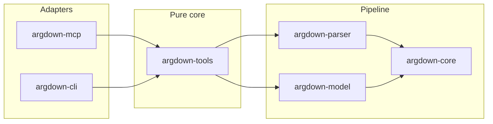

# argdown-mcp

<p align="center">
  <a href="https://github.com/kellenff/argdown-mcp/actions/workflows/ci.yml"></a>
  <a href="https://github.com/kellenff/argdown-mcp/actions/workflows/release.yml"></a>
  <a href="https://github.com/kellenff/argdown-mcp/releases/latest"></a>
</p>

> Tell an agent which arguments survive, not which arguments it prefers.

Argdown is a notation for argument maps. [argdown/argdown](https://github.com/argdown/argdown) parses and visualizes them. This workspace computes what that stack does not: Dung extension semantics (grounded, preferred, stable, complete), QBAF DF-QuAD degrees, and the resolved Layer B model. Exposed over MCP stdio for agents and over a stdin-only CLI for shell pipelines.

## Quick links

- [Argdown syntax guide](https://argdown.org/guide)
- [Releases](https://github.com/kellenff/argdown-mcp/releases)
- [Using the CLI](#using-the-cli)
- [Cursor/Claude plugin](plugins/argdown/)
- [Design docs](docs/snowball/)

## What you can do

- Parse Argdown and get a syntactic summary or a byte-offset diagnostic
- Export the resolved Layer B model as JSON or YAML
- Project to a Dung argumentation framework and inspect SCC structure
- Compute extension labellings under four Dung semantics
- Run credulous or skeptical acceptance queries with a witness
- Evaluate QBAF DF-QuAD degrees with a configurable threshold

## Example (verified against v0.1.1)

Given two arguments where B attacks A:

```argdown
<A>: a

<B>: b
  -> <A>
```

Under grounded semantics, B is in and A is out:

```bash
printf '<A>: a\n\n<B>: b\n  -> <A>\n' | argdown dung
```

```json
{
  "in": [{ "id": 1, "title": "B" }],
  "out": [{ "id": 0, "title": "A" }],
  "undec": []
}
```

The same source through the full extensions tool:

```bash
printf '<A>: a\n\n<B>: b\n  -> <A>\n' | argdown extensions --semantics grounded
```

```json
{
  "semantics": "grounded",
  "algorithm": "grounded_fixpoint",
  "labellings": [[
    { "id": 0, "title": "A", "label": "out" },
    { "id": 1, "title": "B", "label": "in" }
  ]],
  "extension_sets": [[{ "id": 1, "title": "B" }]]
}
```

## MCP setup

Every tool takes inline `source` (Argdown text). No filesystem access.

### Cursor

Add to `.cursor/mcp.json` (or use the [plugin](#cursor--claude-plugin) below):

```json
{
  "mcpServers": {
    "argdown": {
      "command": "/path/to/argdown-mcp",
      "args": []
    }
  }
}
```

On macOS/Linux after installing from [releases](https://github.com/kellenff/argdown-mcp/releases), the binary is `argdown-mcp`. On Windows, `argdown-mcp.exe`.

### Claude Desktop / Claude Code

```json
{
  "mcpServers": {
    "argdown": {
      "type": "stdio",
      "command": "/path/to/argdown-mcp"
    }
  }
}
```

### Agent round trip

Call the `extensions` tool with:

```json
{
  "source": "<A>: a\n\n<B>: b\n  -> <A>",
  "semantics": "grounded"
}
```

You get labellings and extension sets in the response. Prefer `extensions` over the deprecated `dung_extensions` alias (removed in v2).

## Install

### Pre-built binary (recommended)

1. Download `argdown-mcp-v0.1.1-<target>.tar.gz` (or `.zip` on Windows) from [Releases](https://github.com/kellenff/argdown-mcp/releases).
2. Extract `argdown-mcp` (or `argdown-mcp.exe`) and put it on your `PATH`.

Pre-built binaries are cross-compiled for Linux, macOS (Intel and Apple silicon), and Windows. `cargo install` works but only builds for your local toolchain host.

The [Cursor/Claude plugin](plugins/argdown/) launcher downloads the matching release, verifies SHA-256 against `SHA256SUMS`, and optionally checks GitHub provenance attestation when `gh` is installed.

### Build from source

```bash
git clone https://github.com/kellenff/argdown-mcp.git
cd argdown-mcp
cargo build --release -p argdown-mcp -p argdown-cli
```

Binaries land in `target/release/argdown-mcp` and `target/release/argdown`.

### CLI only

```bash
cargo install --path crates/argdown-cli
```

The `argdown` CLI is not in GitHub release artifacts yet. Build from source or `cargo install` as above.

## Using the CLI

The `argdown` binary is a stdin-only front-end to the same logic as the MCP server. No file paths, no positional source argument: Argdown text always comes from stdin; results go to stdout as JSON.

| Stream | Content |
|--------|---------|
| stdin | Argdown source text |
| stdout | JSON result on success |
| stderr | Parse errors and diagnostics |
| exit code | `0` on success, `1` on failure |

### Get the binary

```bash
# from a clone (see Build from source above)
cargo build --release -p argdown-cli
export PATH="$PWD/target/release:$PATH"

# or install into ~/.cargo/bin
cargo install --path crates/argdown-cli
```

Confirm it runs:

```bash
argdown --help
```

### Run a command

General shape:

```bash
argdown <subcommand> [flags]   # reads Argdown from stdin
```

Three ways to supply input:

```bash
# pipe
printf '<A>: a\n\n<B>: b\n  -> <A>\n' | argdown dung

# redirect a file
argdown extensions --semantics preferred < debate.ad

# heredoc
argdown parse <<'EOF'
<A>: a

<B>: b
  -> <A>
EOF
```

Chain with `jq` like any other JSON CLI:

```bash
argdown dung < debate.ad | jq '.in[].title'
```

### Commands

| Subcommand | Flags | What it does |
|------------|-------|--------------|
| `parse` | | Syntactic block counts; parse errors on stderr |
| `export` | `--format json\|yaml` (default `json`) | Resolved Layer B model |
| `dung` | | Grounded IN/OUT/UNDEC partition (shortcut) |
| `inspect-af` | | Dung AF: arguments, attacks, SCC metadata |
| `extensions` | `--semantics grounded\|preferred\|stable\|complete` (default `preferred`) | Full labellings and extension sets |
| `accepts` | `<id>` plus `--semantics …`, `--mode credulous\|skeptical` | Point query on one argument |
| `qbaf` | `--threshold <f64>` (default `0.5`) | QBAF DF-QuAD degrees |

Examples:

```bash
# parse summary
argdown parse < map.ad

# Layer B model as YAML
argdown export --format yaml < map.ad

# grounded extension (same probe as the Example section above)
printf '<A>: a\n\n<B>: b\n  -> <A>\n' | argdown dung

# preferred semantics (default)
argdown extensions < map.ad

# stable semantics, explicit
argdown extensions --semantics stable < map.ad

# is argument id 1 credulously accepted under preferred?
argdown accepts 1 --semantics preferred --mode credulous < map.ad

# weighted degrees at threshold 0.6
argdown qbaf --threshold 0.6 < map.ad
```

### Errors

On parse failure the CLI writes a human-readable message to stderr and exits `1`. Stdout stays empty.

```bash
$ printf 'not argdown\n' | argdown parse
argdown: … (at byte …)
$ echo $?
1
```

Use `argdown <subcommand> --help` for flag details. MCP tool names differ slightly (`export_model`, `inspect_af`, `qbaf_evaluate`); the CLI uses kebab-case subcommands with the same semantics.

## Tools reference

| Tool | Input | Output | When to use |
|------|-------|--------|-------------|
| `parse` | `source` | Syntactic summary or diagnostic | Validate Argdown before deeper analysis |
| `export_model` | `source`, optional `format` | Layer B model (JSON/YAML) | Inspect resolved statements, PCS roles, edges |
| `inspect_af` | `source` | Dung AF with SCC metadata | See the attack graph structure |
| `extensions` | `source`, optional `semantics` | Labellings + extension sets | Which arguments survive (default: preferred) |
| `accepts` | `source`, `argument_id`, `semantics`, `mode` | Acceptance status + witness | Point query on one argument |
| `qbaf_evaluate` | `source`, optional `threshold` | DF-QuAD degrees + status | Weighted bipolar reasoning |
| `dung_extensions` | `source` | IN/OUT/UNDEC (grounded only) | **Deprecated** - use `extensions` with `semantics: "grounded"` |

CLI equivalents: see [Using the CLI](#using-the-cli).

## Cursor / Claude plugin

The `plugins/argdown/` directory ships a Cursor/Claude plugin that:

- Downloads and verifies the `argdown-mcp` release binary for your platform
- Registers the MCP server in `.mcp.json`
- Includes an `argdown-analysis` skill and `/analyze` command

Point your plugin root at `plugins/argdown/` or install from the repository once published.

## Architecture



| Crate | Role |
|-------|------|
| `argdown-core` | Shared AST and error types |
| `argdown-parser` | Layer A: parse Argdown source to AST |
| `argdown-model` | Layer B: resolve model, Dung solver, QBAF engine |
| `argdown-tools` | Pure `&str` -> result functions (shared by MCP and CLI) |
| `argdown-mcp` | `rmcp` stdio server and tool schemas |
| `argdown-cli` | `clap` stdin/stdout front-end |

## Why this exists

[argdown/argdown](https://github.com/argdown/argdown) gives you argument structure: statements, relations, PCS roles, visual maps. It does not answer which arguments hold once attacks resolve. That gap shows up quickly when an LLM drafts an argument map in prose and you need a formal verdict on what survives.

This workspace is a Rust implementation of that missing semantics layer. The parser and model follow the Argdown Layer A / Layer B split used in this repo's design docs. MCP stdio and a stdin-only CLI keep the surface small for agent and pipe workflows.

## State of v0.1.1

| Status | Item |
|--------|------|
| Done | Dung solver (grounded, preferred, stable, complete) |
| Done | MCP stdio server with seven tools |
| Done | `argdown` CLI (build from source or `cargo install --path`) |
| Done | Cross-compiled `argdown-mcp` release binaries with SHA-256 + optional provenance attestation |
| Partial | `argdown` CLI is not yet bundled in GitHub release artifacts |
| Partial | `dung_extensions` MCP alias is deprecated; use `extensions` with `semantics: "grounded"` |
| Pending | `LICENSE` file in the repository root (license terms not yet published on GitHub) |

## Building and testing

```bash
cargo test --workspace
cargo clippy --workspace --all-targets -- -D warnings
cargo fmt --all --check
```

CI runs fmt, clippy, build, and test on Linux, macOS (Intel and ARM), and Windows. Fuzz targets live under `fuzz/`.

## Related projects

- [argdown/argdown](https://github.com/argdown/argdown) - Argdown language and visualisation
- [modelcontextprotocol/rust-sdk](https://github.com/modelcontextprotocol/rust-sdk) - Rust MCP SDK (`rmcp`)

## License

No `LICENSE` file is committed yet. Check the repository license field before adopting in production.
